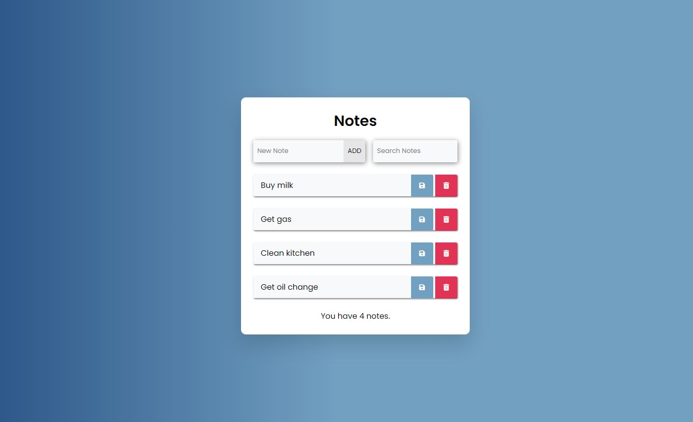

# Todo List
> This project was part of my onboarding training for my job at DKW Communications.
As part of the training, I learned Vue.js and this is an extension of the 
[Training_Vue-2_Introduction](https://github.com/MarlisaRebaum/Training_Vue-2_Introduction).

## Table of Contents
* [General Info](#general-information)
* [Links](#links)
* [Technologies Used](#technologies-used)
* [Screenshots](#screenshots)
* [Project Status](#project-status)
* [Contact](#contact)

## General Information
The following instructions were provided to me and I was to create an app
based on these:

### Instructions

Fork this repository into your own account and clone it to your local machine.

This project will give you a small "Todo" application to build in Vue, using the 
tools learned from the official VueJS docs. It uses a CDN version of Vue and a 
single HTML file, so you don't need to mess around with build tools. This also 
means you shouldn't try to use `Single File Component` or other topics covered 
in the Vue docs that require transpiling.

### Resources

- [VueJS Docs](https://vuejs.org/v2/guide/index.html)
- [Vue DevTools](https://chrome.google.com/webstore/detail/vuejs-devtools/nhdogjmejiglipccpnnnanhbledajbpd)

### Objectives

- Read through the `Components Basics` and `Transitions & Animation` portions 
of the Vue docs and follow along with the `/index.html` file. You should be 
able to just open the file in your browser to run it. eg: `file:///C:/Users/{UserID}/Desktop/Training_Vue-2_Intermediate/index.html`

- Use the tools learned in the Vue docs to expand the `/index.html` file into a full "Todo" app.

  - Can view a listing of reminder notes, one per line.

    - "Notes" should be a custom component that contains all the logic needed 
    for a given note's behavior. Use the syntax demonstrated in 
    [`Components Basics`](https://vuejs.org/v2/guide/components.html), not `Single File components`.

  - Can add a new reminder note with with user-supplied text.

    - Give a button that adds the note when clicked.

      - If no note is entered, the button click should do nothing.

    - If the textbox is focused, hitting `Enter` should add the note.

  - Can edit a reminder note to change its text.

    - Give a button that saves the edit when clicked.

      - If no note is entered, the button click should do nothing.

    - If the textbox is focused, hitting `Enter` should update the note.

  - Can remove a reminder note from the list.

  - Use a `computed` property to display a count of current total list items 
  somewhere on the page.

  - Use a `watch`ed property to clear the entire todo list if the user types 
  only the word "clear" into the textbox for adding a new note.

  - Provide a "Filter" textbox that can filter the notes list as the user types 
  into it by searching for the filter text anywhere within the reminder notes.

    - An empty filter should display the entire list.

    - Use another `computed` property to display a count of current filtered 
    list items somewhere on the page.

  - Use [`Class and Style Bindings`](https://vuejs.org/v2/guide/class-and-style.html) 
  to apply custom CSS classes to the page elements.

    - Use the `Object Syntax` to set different classes on the outer-most `note` 
    element based on if it's in editing mode or not.

    - Use the `Array Syntax` to set multiple classes on a container element 
    around the `new note` section of the page. This class array should come 
    from a single `computed` property.

  - Use [`Transitions and Animation`](https://vuejs.org/v2/guide/transitions.html) 
  to apply transitions for notes being created and deleted.

    - This will need to use a `Transition Group` and can use the same transition 
    definition for both entrance and exit states.

## Links
- Live Demo URL: [https://marlisarebaum.github.io/todo-list/](https://marlisarebaum.github.io/todo-list/)

## Technologies Used

## Screenshots

## Project Status
Project is:  _complete_ 

## Contact
Created by [Marlisa Rebaum](https://www.linkedin.com/in/marlisarebaum/) - feel free to contact me!